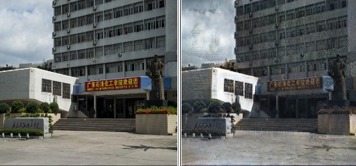
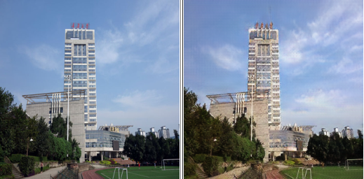

# Cycle_GAN_Game_of_Thrones

## Brief Intro

*__Author__=='Danding Su'*

*__Time__=='12/7 2021'*

    Towards unpaired Image-to-Image Translation: new datasets with the style of the ‘Game of Thrones’ and their applications with Cycle-GAN

The implementation of cycle-GAN is from this [repository](https://github.com/junyanz/pytorch-CycleGAN-and-pix2pix)

The link of datasets will come here soon...If it's greatly needed, you may contact me by GitHub, thanks.

## Content

<!-- TOC -->

- [Cycle_GAN_Game_of_Thrones](#cycle_gan_game_of_thrones)
  - [Basic](#basic)
  - [Content](#content)
  - [Abstract](#abstract)
  - [Introduction](#introduction)
  - [Datasets](#datasets)
  - [Implementations](#implementations)
  - [Results](#results)
    - [From thrones to fixers:](#from-thrones-to-fixers)
    - [From fixers to thrones](#from-fixers-to-thrones)
  - [References](#references)

<!-- /TOC -->

---

## Abstract

Image-to-image translation is a class of vision and graphics problems where the goal is to learn the mapping between an input image and an output image using a training set of aligned image pairs. For the "Game of Thrones" style transfer problem, we propose two high-quality datasets, and after verification, using the Cycle-GAN model can achieve a great result.

## Introduction

"You know nothing, John Snow!" Although it has been more than two years since the end of this HBO American drama, "Game of Thrones", this line of Ygritte still echoes in our ears. . I have to admit that we can never forget the company of these eight years, and we often cherish the memory of the time we are still chasing drama, as if we are also in that savage but romantic world.

This poem of ice and fire gives us too much room for imagination, using the unique colors of that world. With imagination, we can "be in" that world, and everything has a corresponding appearance. Now, we are not satisfied with imagination, we have to see it with our own eyes! This article will introduce two new and useful data sets to transform what we saw together into a Game of Thrones style.

Image-to-image conversion is a type of vision and graphics problem, and its goal is to use a set of aligned image pairs to learn the mapping between the input image and the output image. However, for "Game of Thrones", we don't have paired training data available. So we chose Cycle-GAN, which has been popular in recent years, to learn to transform the image from the input domain to the target domain (Game of Thrones) without pairing examples.

**But why don't we adopt the most basic generative confrontation network?**

First of all, generative adversarial network is a deep learning model that produces fairly good output through mutual game learning between generative models and discriminative models, and is often used for image generation, fitting data distribution, and so on.

The traditional generative confrontation network structure is as follows:

However, the traditional generative confrontation network cannot realize the style transfer of the image, because the traditional generative confrontation network can only learn the style information in the training image, and cannot obtain the content information of the image to be transferred, even if the image to be transferred is used to replace the noise. You will get results that are similar in style but completely different in content.

**So, let's use the CycleGAN!**

The orginal paper released in ICCV 2017 is [here](https://arxiv.org/pdf/1703.10593.pdf)

## Datasets

Let's get straight to the point. We constructed a total of three data sets, namely GoT_castle2building, castle2building, and GoT2Fixers. Their respective data volumes and construction methods are as follows:

**GoT_castle2building** data is divided into two parts, 273 from the castle of Game of Thrones and 924 from Baidu's teaching building, the number of pixels is 600 * 600. The data has been manually screened to remove more than half of the problematic pictures containing obvious watermarks, inconsistent content, and processing, and the rest are high-quality data.

**Castle2building** data is also divided into two parts, 2148 pictures of Nordic castles from Bing Pictures, and 1948 pictures of teaching buildings from Bing Pictures. The number of pixels is 600 * 600. The data has also been manually screened to remove over 60% of problematic pictures containing obvious watermarks, content inconsistencies, and processing, and the rest are high-quality data.

**GoT2Fixers** data is divided into two parts, from the first season of Game of Thrones a total of eight episodes of 1080p film source frame extraction (one picture is extracted every 100 frames) processed and filtered 6168 pictures, from Bilibili's variety show, the house is the first rescuer There are a total of eight episodes of 1080p source frames in the season (also one picture per 100 frames) processed and filtered 7372 pictures. After zooming into a 640*360 pixel picture, it is manually screened to remove invalid content such as the opening and ending credits, and remove too many close-up decoration drawings in the house rescue (because there is no corresponding intention in the Game of Thrones) and other inappropriate pictures. Makes the ratio of characters to houses and other scenery is about 4:1, which is consistent with the ratio in Game of Thrones.

## Implementations

We used **3 NVIDIA RTX 2080Ti 11GB** to train the model in this experiment. For each data set, **200 Epochs** are trained. For the first 100 Epochs, the **learning rate** is 0.0002000, and for the next 100 Epochs, the learning rate gradually **decays** from 0.0002000 to 0. The **batch size** of training is set to 8, and **checkpoints** are saved every five Epochs.

The training set and the test set are randomly divided into the data set according to the ratio of **4:1**.

The running time of using the **GoT_castle2building** dataset is ninety seconds an epoch, which takes about **5** hours. The running time of using **castle2building** data set is one epoch of one hundred and ninety seconds, which takes about **10.5** hours. The running time using the **GoT2Fixers** model is 500 seconds an epoch, which takes nearly **28** hours.

The change of the loss function is shown in the figure below. It can be seen that although the loss function fluctuates in the first 100 epochs, it is in a downward trend as a whole. After 100 epochs, the loss function basically stabilizes.

## Results

This article focuses on the realization of transforming real pictures into "Game of Thrones" style pictures. Cycle-GAN was selected as the implementation method, two high-quality data sets of power game style were constructed, and the adjustment and training of the conversion model were realized, and excellent results were obtained in human evaluation.

**The details of the evaluation are as follows:**

The training results of **GoT_castle2building** are as follows. It can be seen that although the number of castle pictures in the style of Game of Thrones is very small, it still achieves great effects in style conversion, such as making the surface of the teaching building as rough as a castle, making the color tone more gray and dark, but There will also be drawbacks. For example, the rough surface of the castle can be changed with the same texture of the floor. It should be because the data set is relatively small, and the characteristics of learning are not specific and insufficient.

The results of **castle2building** training are as follows, which shows little effect. The reason for the analysis is probably: the Nordic castles downloaded by the crawler are mostly landscape photos under sufficient light, and the pictures of the teaching building are also pictures under sufficient light. The difference between the two is small, because the style conversion depends on the style content. Correspondence, so the small gap style conversion relationship cannot be well expressed in GAN training. Reducing the learning rate or increasing the training rounds should continue to optimize the training effect, but it is limited to the dataset and the optimization is quite difficult.

The training results of **GoT2Fixers** are as follows, it can be seen that the effect is very good. The natural scenery can be converted into the cold gray tone of Lindong City according to the color tone, and the warmer tone can also be converted into the golden and brilliant tone of Junlin City. The character will automatically adjust to a single light according to the background backlight, face shadow coverage, and the style is extremely close to the game of power.

### From thrones to fixers:

### From fixers to thrones

**Generalization test**: The following data uses the style conversion results generated by the model trained on the GoT2Fixers dataset. The result is more natural, and the conversion from lighting angle to tone consistency is more successful and appropriate. From the building type of the library to the type of natural scenery at the entrance of the campus, both single-person and multi-person scenes can achieve good transformation effects.

## References

1.	J Y Zhu, T Park, P Isola, A Efros Unpaired Image-to-Image Translation using Cycle-Consistent Adversarial Networks. In ICCV 2017.

2.	Y. Aytar, L. Castrejon, C. Vondrick, H. Pirsiavash, and A. Torralba. Cross-modal scene networks. PAMI, 2016.

3.	K. Bousmalis, N. Silberman, D. Dohan, D. Erhan, and D. Krishnan. Unsupervised pixel-level domain adaptation with generative adversarial networks. In CVPR, 2017.

4. R. W. Brislin. Back-translation for cross-cultural research. Journal of cross-cultural psychology, 1(3):185–216, 1970.

5.	M. Cordts, M. Omran, S. Ramos, T. Rehfeld, M. Enzweiler, R. Benenson, U. Franke, S. Roth, and B. Schiele. The cityscapes dataset for semantic urban scene understanding. In CVPR, 2016.

6.	J. Deng, W. Dong, R. Socher, L.-J. Li, K. Li, and L. Fei-Fei. Imagenet: A large-scale hierarchical image database. In CVPR, 2009.

7.	E. L. Denton, S. Chintala, R. Fergus, et al. Deep generative image models using a laplacian pyramid of adversarial networks. In NIPS, 2015.

8.	J. Donahue, P. Krahenb ¨ uhl, and T. Darrell. Adversarial ¨ feature learning. In ICLR, 2017.

9.	A. Dosovitskiy and T. Brox. Generating images with perceptual similarity metrics based on deep networks. In NIPS, 2016.

10.	I. Goodfellow, J. Pouget-Abadie, M. Mirza, B. Xu, D. Warde-Farley, S. Ozair, A. Courville, and Y. Bengio. Generative adversarial nets. In NIPS, 2014.

11.	V. Dumoulin, I. Belghazi, B. Poole, A. Lamb, M. Arjovsky, O. Mastropietro, and A. Courville. Adversarially learned inference. In ICLR, 2017.

12.	A. A. Efros and T. K. Leung. Texture synthesis by non-parametric sampling. In ICCV, 1999.

13.	D. Eigen and R. Fergus. Predicting depth, surface normals and semantic labels with a common multi-scale convolutional architecture. In ICCV, 2015.

14.	C. Godard, O. Mac Aodha, and G. J. Brostow. Unsupervised monocular depth estimation with left-right consistency. In CVPR, 2017.

15.	I. Goodfellow. NIPS 2016 tutorial: Generative adversarial networks. arXiv preprint arXiv:1701.00160, 2016.

16.	A. Hertzmann, C. E. Jacobs, N. Oliver, B. Curless, and D. H. Salesin. Image analogies. In SIGGRAPH, 2001.

17.	J. Long, E. Shelhamer, and T. Darrell. Fully convolutional networks for semantic segmentation. In CVPR, 2015.

18.	P. Isola, J.-Y. Zhu, T. Zhou, and A. A. Efros. Image-to-image translation with conditional adversarial networks. In CVPR, 2017.

19.	P. Sangkloy, J. Lu, C. Fang, F. Yu, and J. Hays. Scribbler: Controlling deep image synthesis with sketch and color. In CVPR, 2017.

20.	L. Karacan, Z. Akata, A. Erdem, and E. Erdem. Learning to generate images of outdoor scenes from attributes and semantic layouts. arXiv preprint arXiv:1612.00215, 2016.

21.	R. Rosales, K. Achan, and B. J. Frey. Unsupervised image translation. In ICCV, 2003.

22.	M.-Y. Liu and O. Tuzel. Coupled generative adversarial networks. In NIPS, 2016.

23.	M.-Y. Liu, T. Breuel, and J. Kautz. Unsupervised image-to-image translation networks. In NIPS, 2017.

24.	D. P. Kingma and M. Welling. Auto-encoding variational bayes. ICLR, 2014.

25.	A. Shrivastava, T. Pfister, O. Tuzel, J. Susskind, W. Wang, and R. Webb. Learning from simulated and unsupervised images through adversarial training. In CVPR, 2017.

26.	Y. Taigman, A. Polyak, and L. Wolf. Unsupervised cross-domain image generation. In ICLR, 2017.

27.	J. Johnson, A. Alahi, and L. Fei-Fei. Perceptual losses for real-time style transfer and super-resolution. In ECCV, 2016.

28.	K. He, X. Zhang, S. Ren, and J. Sun. Deep residual learning for image recognition. In CVPR, 2016.

29.	D. Ulyanov, A. Vedaldi, and V. Lempitsky. Instance normalization: The missing ingredient for fast stylization. arXiv preprint arXiv:1607.08022, 2016.

30.	C. Ledig, L. Theis, F. Huszar, J. Caballero, A. Cun- ´ ningham, A. Acosta, A. Aitken, A. Tejani, J. Totz, Z. Wang, et al. Photo-realistic single image superresolution using a generative adversarial network. In CVPR, 2017.

31.	C. Li and M. Wand. Precomputed real-time texture synthesis with markovian generative adversarial networks. ECCV, 2016.
